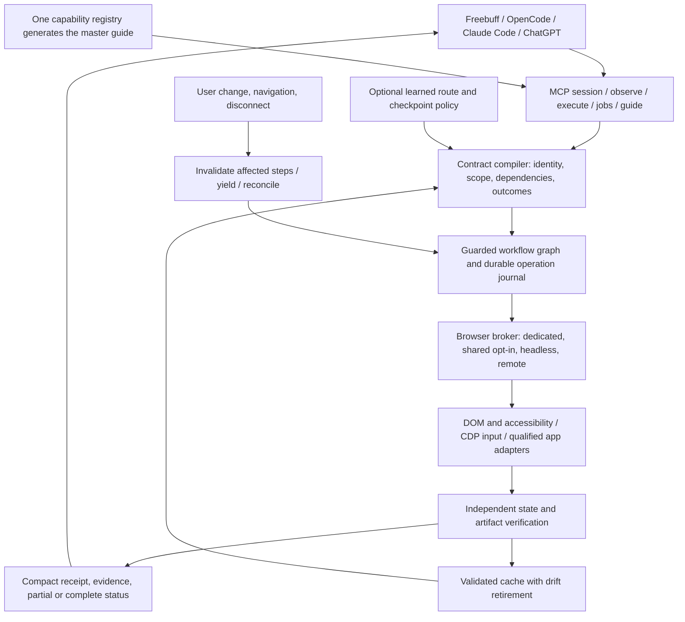

# Chrome Controlla: research and proposed architecture

Research date: 2026-10-06. Status: research and design, not an implemented product or measured performance result.

## 10. Implementation follow-up research — 2026-10-09

These sources were refreshed during v3 implementation with Exa and checked against their current first-party pages. They inform implementation choices; they are not comparative performance evidence.

- [Stagehand v4 reference](https://docs.stagehand.dev/v4/reference/stagehand) documents an experimental service-worker batch callback that avoids an SDK-to-browser round trip per operation. Its timeout prevents later work from starting, but an in-flight operation may still finish. Controlla should keep its bounded executor near the extension, reauthorize each mutation, stop before subsequent dispatch on deadline, and report uncertain in-flight effects as `unknown`; a batch is not atomic.
- [Browser Use MCP guide](https://github.com/webllm/browser-use/blob/main/docs/MCP_SERVER.md) documents a minimal coding-agent profile with two tools, an in-process command runner, serialized access to persistent state, and bounded output. This supports keeping Controlla's default schema compact while preserving one explicit command surface and strict authorization. It does not imply that serialization alone resolves human or external-client interference.
- [Vercel agent-browser](https://github.com/vercel-labs/agent-browser) is a strong CLI-first baseline. Its current repository describes a native Rust CLI and recommends installing a pinned Chrome for Testing runtime. Controlla's comparisons should include CLI-plus-skill usage rather than comparing MCP tool counts alone.
- [Chrome's WebMCP overview](https://developer.chrome.com/docs/ai/webmcp) (updated 2026-10-07) describes WebMCP as a proposed standard and a progressive enhancement for page-declared tools. The [imperative API](https://developer.chrome.com/docs/ai/webmcp/imperative-api) documents JSON-schema input and optional annotations such as read-only and untrusted-content hints. Page declarations remain page-controlled input: rediscover/revalidate schemas, keep page-tool authority explicit, and retain UI fallback. The current docs do not qualify Controlla's real-browser execution or cancellation behavior.
- [Emergence WebVoyager](https://arxiv.org/html/2603.29020v1) reports that clearer task instantiation, failure handling, annotation, and reporting materially changed a previously reported Operator success rate in its audit. For Controlla's competitor harness, preserve raw failed attempts, use fixed task instantiations and independent verification, publish environment/version manifests, and count failures in latency/cost summaries; do not infer leadership from selected successful runs.

The refreshed material strengthens the implementation and evaluation requirements above. No competitor run, real-client smoke, or universal superiority result was produced by this research refresh.

Read with [improvements.md](improvements.md), [build.md](build.md), and [MASTER_GUIDE.md](../MASTER_GUIDE.md). The guide is a proposed runtime contract, not documentation of tools already installed.

## 1. Recommendation

Build a Chrome-only, model-independent execution service extracted selectively from Comptrol. Its central unit should be a **guarded workflow**: a short program with explicit target identity, permissions, dependencies, execution limits, outcome checks, and a durable receipt. Let the calling model express several related actions in one request while the local runtime handles waits, validation, data reduction, and recovery.

The proposed research contribution is **Adaptive Guarded Workflow Compilation (AGWC)**. It jointly chooses a browser route, a safe batch boundary, a minimal observation, and a verification checkpoint. Its objective is the lowest total cost per verified task under correctness and user-interference constraints. This is a testable systems hypothesis, not a claim of scientific priority.

Do not start with training a large world model. First build a reliable executor, fixtures, outcome verifiers, and comparable measurements. Then learn route selection, observation selection, and checkpoint placement from consented traces. These components can improve every supported client without requiring control over the client’s model weights.

“Best” must mean leadership on a named, reproducible workload and version matrix. A universal claim about all sites, users, models, and future tools is not demonstrable. The release target is a measurable Pareto improvement in verified success, time, model tokens, model round trips, and user disruption.

## 2. What was actually investigated

Used GitHub to retrieve repository metadata; cloned and inspected the public source without changing it. Used Exa for five search sweeps of ten requested results each, plus selected page fetches; Parallel Search for Chrome mechanics, app APIs, clients, benchmarks, and input constraints; alphaXiv for discovery and selected full paper text; SciSpace for a complementary literature search. Fifty Exa result slots are not fifty independently validated sources. Deduplicated primary sources supporting conclusions are listed below; low-relevance and marketing results were excluded.

Superpowers brainstorming informed alternatives and uncertainty analysis; writing-plans informed staged implementation and acceptance gates. This request ends with planning artifacts rather than product implementation.

Source inspection baseline: [`Praket7/Comptrol`](https://github.com/Praket7/Comptrol), commit **38a9d7eae0808a04b66e57d8658167c7667b4935**, workspace version **0.1.67**, Apache-2.0. This is the public revision retrieved during this research. It is not proof of the revision running in the other AI’s session, nor of unpublished local changes.

No browser benchmark, client compatibility suite, or live Canva/Slides/CapCut editing task was executed. The user-supplied test report is third-party reported execution evidence, not independently reproduced evidence. Paper results remain their authors’ results.

tldraw created the [editable architecture board](https://www.tldraw.com/f/zttVZI5A_8nKRdpXihLUy). The initial editing session was unavailable; a later retry succeeded and returned 24 diagram shapes. The portable Mermaid diagram below keeps the architecture available without the external board. The board contains architecture only, no source code or private session data; tldraw boards created by this connector are editable by link.

## 3. Comptrol baseline and reported failures

### Source observations

| Source at the pinned revision | Observed implementation | Consequence |
|---|---|---|
| `crates/comptrol-browser/src/lib.rs` | CDP connection and event handling, locators, target/frame graphs, generation/revision checks, upload/download stages | Extract and test these; do not recreate the entire browser transport reflexively |
| `crates/comptrol-browser/src/manager.rs` | Reusable browser connections | Persistent transport is already present; measure remaining serialization and dispatch cost |
| `crates/comptrol-browser/src/session.rs` | Session/provider and cached target abstractions | Audit identity, freshness, and isolation before retaining |
| `crates/comptrol-core/src/lib.rs:1884` onward | Request fingerprint comparison before idempotent replay | The reported changed-expression replay requires exact runtime/path reproduction; a missing fingerprint check is not an established diagnosis |
| Same file, `request_fingerprint`, around line 2903 | Hash includes intent, target, parameters, postcondition, effective risk, dry-run, background posture | Extend principal/session binding and crash semantics; validate canonicalization |
| Same file, `capabilities`, around line 11233 | Considers direct CDP, companion bridge, policy, autostart | Existing reconciliation logic does not prove live catalog truth |
| `crates/comptrol-core/src/browser_bridge.rs:1063` | `bridge_is_active` opens default state storage, checks health, returns false on errors | Preserve diagnostic error causes; test process environment/state-directory divergence as hypotheses |
| `crates/comptrol-core/src/main.rs:944` | Dispatch begins from the first CLI argument; `mcp` enters stdio handling | `mcp --help` needs an early parser test |
| Same file, `run_doctor` around line 1134 | Only no arguments or `--human` accepted | This public code would reject `doctor --help`; it does not support the blanket claim that every tested subcommand ignored help |
| `plugins/comptrol/scripts/launch-comptrol-mcp.cjs` | Searches global PATH for `comptrolling` and throws if absent | Source directly explains the reported launcher error condition |
| `adapters/canva/README.md` and `adapters/google-workspace/README.md` | Document official API routes and a Canva app bridge | Retain only scoped browser-app integrations, contingent on live acceptance |

Pinned source links: [browser crate](https://github.com/Praket7/Comptrol/tree/38a9d7eae0808a04b66e57d8658167c7667b4935/crates/comptrol-browser), [core](https://github.com/Praket7/Comptrol/blob/38a9d7eae0808a04b66e57d8658167c7667b4935/crates/comptrol-core/src/lib.rs), [bridge](https://github.com/Praket7/Comptrol/blob/38a9d7eae0808a04b66e57d8658167c7667b4935/crates/comptrol-core/src/browser_bridge.rs), [CLI](https://github.com/Praket7/Comptrol/blob/38a9d7eae0808a04b66e57d8658167c7667b4935/crates/comptrol-core/src/main.rs), [launcher](https://github.com/Praket7/Comptrol/blob/38a9d7eae0808a04b66e57d8658167c7667b4935/plugins/comptrol/scripts/launch-comptrol-mcp.cjs).

### Preserve the tester’s exact evidence boundary

| Reported observation | Current classification | Required experiment |
|---|---|---|
| Accessibility snapshot delivered while discovery denied; both catalog entries unavailable | Reported observed contradiction | Same principal, process, policy revision, transport, browser, timestamp; trace capability evaluation and dispatch decisions |
| Help ignored, including stdin hang for `mcp --help` | Reported behavior; partial source support, public `doctor` differs | Run every CLI command with help under a subprocess deadline; assert no browser launch, stdin read, or state mutation |
| Doctor not configured while health endpoint alive with 45 targets | Reported discrepancy; root cause unconfirmed | Compare state directories, user identity, endpoint, heartbeat versus actual round trip, clock, DB permissions, binary hashes |
| Global launcher missing | Reported execution; matching source error path | Clean installation with an empty/minimal PATH and no global Comptrol |
| Reusing `eval-1` returned prior expression | Reported replay; source includes conflict protection | Exact request capture, same and changed bodies, concurrent processes, restart, both transports, bridge path |
| Four tabs left open, including `/u/2/cal` 404 | Reported side effects | Ownership ledger and exact-ID cleanup; detect unexpected error page/account |
| Async scripts exceeded eight seconds | Small reported sample | Controlled promises resolving before/at/after deadlines, rejection, navigation, never resolution; do not label awaitPromise universally dead |
| Counts 21 and 42 but only 6–12 rows rendered | Reported incomplete extraction | Virtualized fixture with known ground truth, section expansion and deduplicated traversal |

Do not delete the other tester’s scratch helpers or close their tabs as part of this research. They were not inspected and cleanup was not requested here.

## 4. Competitive landscape and closest prior art

| System | Relevant documented capability | What Chrome Controlla must demonstrate beyond it |
|---|---|---|
| [Playwright MCP](https://github.com/microsoft/playwright-mcp) | Accessibility snapshots, persistent/isolated browser modes, extension connection, script execution; README discusses CLI token efficiency | Better verified task economics, not merely fewer exposed tools |
| [Chrome DevTools MCP](https://github.com/ChromeDevTools/chrome-devtools-mcp) | Puppeteer-based automation, performance/network debugging, slim mode, CLI | Better general task completion and recovery while retaining useful debugging |
| [Stagehand](https://github.com/browserbase/stagehand) | Natural language plus deterministic code, extraction, action caching and self-healing | Safer cache admission/retirement and measurable benefits under interference |
| [Browser Use](https://github.com/browser-use/browser-use) | Browser-agent framework with model and cloud ecosystem | Same-model executor comparison separately from full-agent comparison |
| [Vercel agent-browser](https://github.com/vercel-labs/agent-browser) | Native CLI and agent-oriented browser operation | Include CLI+skill as a serious baseline; MCP tool count alone cannot win |
| [BrowserOS](https://github.com/browseros-ai/BrowserOS/tree/main/packages/browseros-agent) | Browser agent platform, MCP, CLI and evaluation framework | Isolation and operating-cost comparison with matched permissions |
| [Stagehand REPL MCP](https://github.com/srozov/stagehand-repl-mcp) | Persistent scriptable browser and multiple actions per invocation | One-call scripting is already prior art |
| [Claude Code with Chrome](https://code.claude.com/docs/en/chrome) | Browser extension uses logged-in state and visible tabs; login/CAPTCHA human handoff | Measure disruption, background qualification and task outcomes on an eligible installation |
| [Claude Code computer use](https://code.claude.com/docs/en/computer-use) / Cowork | Broader product flows; precise tools are preferred where available | Treat each product/surface separately; do not attribute screen-only behavior to all Claude routes |
| Selected Computer plugin | This session exposes persistent JavaScript browser control | It already supports code orchestration; qualify the actual tool version and benchmark it rather than assuming screenshot-only use |

Do not publish a performance ranking from documentation. Product internals, versions, eligible accounts, hidden inference, and app permissions differ. If a proprietary tool cannot be run reproducibly, mark its comparison unavailable.

### Literature synthesis

1. **Reusable tools are established.** [PAFFA](https://arxiv.org/abs/2412.07958) studies reusable browser interaction functions. [WALT](https://arxiv.org/abs/2510.01524) discovers website functionality and turns it into validated tools, with code at [SalesforceAIResearch/WALT](https://github.com/SalesforceAIResearch/WALT). Their published results do not establish gains on Canva or CapCut. Implication: learn reusable workflows, but do not claim their invention.
2. **Observe less, but preserve decisive information.** Accessibility/DOM representations and filtered observations reduce payloads. Visual information remains necessary for canvas geometry and design quality. An observation should carry omissions and freshness; compression must not erase a disabled control, changed account, warning, or destructive-action label.
3. **Pre-action validation is established.** [Atomicity for Agents](https://arxiv.org/abs/2603.00476) studies stale observation/action assumptions and DOM/layout monitoring. Its client-side mitigation narrows the race window; it does not provide server transaction isolation. Implication: explicitly measure the residual race instead of promising immunity to user changes.
4. **World models can aid decisions.** [Web Agents with World Models](https://arxiv.org/abs/2410.13232) predicts meaningful state differences and evaluates candidate actions. Its comparisons are to particular research baselines. [SimuRA](https://arxiv.org/abs/2507.23773), retrieved at abstract level, is another planning direction. Neither licenses imagined results as evidence that a real action succeeded.
5. **Learning task structure has closer prior art than a simple macro recorder.** Full-text review of [Inducing Task Models from Computer-Use Traces](https://arxiv.org/abs/2608.20319) found explicit goal and procedure models for interleaved activity. Adopt typed control flow and provenance; avoid copying its benchmark claims into this product.
6. **RL depends on trustworthy tasks and rewards.** Full-text review of [SCALECUA](https://arxiv.org/abs/2607.11185) supports verifiable task generation and selecting tasks near the learning frontier. Its desktop benchmarks and training results are not browser-MCP performance measurements. Start with a small scheduler policy; foundation-model RL is a separate costly program.
7. **Verifiers are a first-class subsystem.** [The Art of Building Verifiers for Computer Use Agents](https://arxiv.org/abs/2604.06240), reviewed in full text, separates process and outcome evidence and emphasizes rubric quality and trajectory coverage. Use independent state checks where possible; score visual aesthetics separately. Do not claim a perfect verifier.
8. **Code execution and progressive tool discovery are established.** [Anthropic’s MCP engineering article](https://www.anthropic.com/engineering/code-execution-with-mcp) describes reducing schema and intermediate-result overhead. Its illustrative savings are not a Chrome Controlla target or expected result.

Additional discovery leads, not relied on for detailed performance claims: [TGPO](https://arxiv.org/abs/2509.14172), [Qwen-AgentWorld](https://www.alphaxiv.org/abs/2606.24597), [Probe to Act](https://www.alphaxiv.org/abs/2609.33646), and [CUA-Sandbox](https://www.alphaxiv.org/abs/2609.32750). Inspect code, licenses, compute, and actual task overlap before adopting them. Literature indexing includes preprints; “found in SciSpace” does not mean peer reviewed.

## 5. Three architectural choices

| Choice | Benefits | Costs | Decision |
|---|---|---|---|
| Extend the entire Comptrol daemon and hide non-Chrome tools | Most immediate reuse | Carries desktop/platform dependencies and ambiguous capability routes | Reject as final architecture |
| Extract browser engine and selected infrastructure into a dedicated service | Retains useful Rust code; smaller surface; explicit browser contracts | Requires careful extraction and package work | Recommended |
| New TypeScript/Playwright service from scratch | Fast ecosystem integration and straightforward authoring | Throws away tested primitives; another transport may not improve speed | Use as reference baseline and contingency if extraction fails measured maintenance/performance criteria |

Use Rust for the persistent browser broker/executor, SQLite for bounded operation state, and a constrained JavaScript authoring runtime. Choose an embedded engine only after a small interruptibility and memory-cap spike. A separate QuickJS process is a candidate, not a prequalified security boundary. No `node:vm` claim of secure isolation. Pin toolchain/dependencies at implementation and run identical fixtures through the reference Playwright runner.

## 6. AGWC: precise proposed contribution

### Contract

A workflow binds `{principal, session, browser_instance, profile, target_id, navigation_epoch, frame_id, document_id/account_if_applicable}` and declares permitted origins, artifacts, effects, deadlines, and outcome predicates. Each step records its semantic dependencies: selected record, input value, target identity, geometry if needed, and relevant app revision. The runtime chooses a route only among currently authorized and qualified routes.

The intermediate representation is a directed graph containing `observe`, `read`, `act`, `wait`, `verify`, `branch`, `checkpoint`, and `yield` nodes. No unrestricted parallel writes to a shared document. Steps have declared read/write footprints and effect classes, but these are conservative metadata rather than proof that an arbitrary web application is pure.

### Compilation and execution

1. Resolve the exact session and app identity; get a capability revision.
2. Choose the smallest sufficient observation: structured facts, subtree, or cropped visual region.
3. Form a dependency graph and reject ambiguous target references.
4. Batch deterministic steps until an uncertainty, external-effect, authority, or shared-resource boundary.
5. Before each mutation, revalidate relevant identity and state close to dispatch. Ignore unrelated ad counters only when the dependency checker can establish irrelevance; otherwise invalidate conservatively.
6. Execute through persistent CDP, typed DOM primitives, or a qualified official app adapter.
7. Collect actual outcomes. Commit a durable receipt for completed steps; checkpoint before crossing the next effect boundary.
8. On unexpected state, return the minimal useful diff and remaining graph. Do not replay completed external effects.

This is **not an ACID browser transaction**. JavaScript tasks, browser input, page event handlers, remote servers, and human collaborators can interleave. A tab lease coordinates Chrome Controlla workers, not the person, website, or every other program. Native server revision checks provide stronger protection where available.

### Joint optimization

Minimize expected `model_time + browser_time + verification_time + recovery_time + token_cost + human_interruption_cost`, subject to a predeclared correctness floor and wrong-target/authority gates. Report the individual units; do not hide seconds and dollars in an unexplained composite score.

A useful implementation starts with deterministic rules. Estimate whether a batch’s saved model round trips exceed its expected stale-state recovery cost. Later fit a contextual bandit using features such as route health, DOM churn, shared versus isolated mode, action reversibility, account certainty, workflow age, and verifier cost. Never let the learned policy waive authorization or identity checks.

### Potentially distinctive combination to test

AGWC combines dependency-scoped invalidation, effect-aware batch boundaries, resource scheduling, evidence-producing checkpoints, and cache retirement under one cost objective. Closest components already exist in WALT, Stagehand, PAFFA, Atomicity for Agents, and conventional optimistic concurrency. This research did not establish that their exact combination is globally novel. Publish a systems contribution only if ablation demonstrates added value beyond combining existing methods.

### Ablations that can falsify the idea

Compare the same underlying model with: single-step control; fixed batches; code mode; cached workflows; cached workflows plus pre-action validation; full AGWC; AGWC without selective observations; AGWC without retirement; optional learned scheduling. Test quiet, high-churn, and human-interference conditions. If AGWC loses after counting guards, compilation, cache preparation and verifier cost, simplify it. A negative result is actionable.

## 7. Chrome modes, isolation, and disruption

| Mode | Practical behavior | Required qualification |
|---|---|---|
| Dedicated headed profile | Separate Chrome profile/window; browser-level input can avoid physical pointer movement | No activation unless authorized; apps may still need visibility, media/GPU or focus |
| Dedicated headless | Browser runs without visible windows | Login, WebGL, video codecs, extensions, downloads and export must be tested per platform/app |
| Shared browser attachment | User explicitly selects existing tabs/profile via extension | Highest interference risk; never default to active-tab targeting or assume ownership |
| Remote isolated browser | Separate process/host with streamed preview | Authentication, data location, latency, cost, uploads/downloads, tenant separation |

Chrome documents that remote debugging switches from Chrome 136 require a non-default user-data directory for normal Chrome. Use a dedicated profile or Chrome for Testing; do not weaken this protection or copy the user’s credential databases. [Chrome remote debugging](https://developer.chrome.com/blog/remote-debugging-port).

The extension route uses `chrome.debugger`, whose domains and attachment permissions are constrained; frames and out-of-process iframes require deliberate routing. It is not interchangeable with an unrestricted browser CDP endpoint. [Debugger API](https://developer.chrome.com/docs/extensions/reference/api/debugger).

Headless is a real supported Chrome mode, but headless support for every web app is a separate claim. [Chrome Headless](https://developer.chrome.com/docs/chromium/headless). Background timer/render throttling means fixed sleep timing is unreliable; wait on task-relevant evidence rather than generic network-idle or animation timers. [Chromium background behavior](https://blog.chromium.org/2020/11/tab-throttling-and-more-performance.html).

### Separate click and clipboard

CDP can dispatch mouse/key events into a target without moving the OS cursor. Use semantic locators first, then target-bound viewport coordinates with a fresh geometry/hit-test check. This is an independent logical input path, not a universal second desktop cursor. [CDP Input](https://chromedevtools.github.io/devtools-protocol/tot/Input/).

Maintain a per-session internal clipboard for text, HTML, images and artifact references. Prefer direct text insertion, typed file upload, or official app operations. The web Clipboard API addresses the system clipboard and has permission/activation constraints; a second profile does not guarantee isolation. [Clipboard API](https://developer.mozilla.org/en-US/docs/Web/API/Clipboard_API).

A clipboard save/restore strategy can overwrite a user’s intervening copy, so it is not a guarantee. Native clipboard operations should require an explicit foreground capability or a separately qualified OS/VM session. In strict background mode, return `needs_foreground` rather than quietly changing the clipboard.

### Fast letter-by-letter typing and drag

Expose `fill`, `insert_text`, and `key_sequence` separately. `key_sequence` produces sequential key/input behavior, configurable delay and per-field backpressure, in one MCP request. Zero configured delay is a throughput option, not a promised typing rate. Verify the final value, input masks, Unicode graphemes, IME and rich-text behavior. Playwright’s [`pressSequentially`](https://playwright.dev/docs/api/class-locator#locator-press-sequentially) is a reference for the distinct semantics.

For drag: obtain exact source and destination, verify viewport/zoom/scroll and document epoch, dispatch a bounded pointer trajectory, and read back the new object order or position. A DOM `dragstart` event alone is not proof of native drag equivalence. Canvas editors need visual grounding or app object IDs.

## 8. Data extraction that knows what it missed

Prefer an authorized structured API, then page-local structured data/DOM, then accessibility, then OCR. Page scripts do not receive permission to access unrelated origins, files, credentials, or internal services. Do not call undocumented write endpoints merely because network traffic reveals them.

Run extraction near the browser and return typed records or an artifact reference, not megabytes of HTML. Every result includes source identity, filters, collection time, schema, unique IDs, discovered count, expected count if trustworthy, cursor state, truncation, and completion status.

For virtual lists: identify the true scroll container; enumerate sections; expand each and confirm its state; collect stable item IDs; scroll with overlap; wait for new item identities; detect pagination; deduplicate; record why traversal ended. “No new rows twice” is only a heuristic, not proof of completeness. Counts can be stale or refer to another filter, so matching a number alone is insufficient.

Allowed statuses: `complete` with a defensible end condition; `partial` with rows and missing coverage; `unknown` where coverage cannot be assessed. For the tester’s case, 21/42 bucket labels and 6–12 visible rows must produce `partial`, preserving each count’s meaning. Use a fixture with exactly 42 unique records to test full traversal and a blocked subsection to test honest partial output.

## 9. Professional design applications

Professional output requires both reliable editing and competent design judgment. An MCP supplies control and evidence; the model/art director supplies composition, typography, asset choice and editorial intent. Evaluate these separately.

### Google Slides

Use the official Slides API for supported object-level edits when separately authorized, with `batchUpdate`, exact presentation/object IDs and `writeControl` revision protection. The API documents atomic application of a batch, but concurrent collaborators still matter. Read back object data and inspect rendered slides. [Slides overview](https://developers.google.com/workspace/slides/api/guides/overview), [batchUpdate](https://developers.google.com/workspace/slides/api/reference/rest/v1/presentations/batchUpdate).

The browser route remains necessary for unsupported editor operations and visual acceptance. Keep a browser-only benchmark track separate from API-assisted performance. A control-plane success must not stand in for saved deck verification.

### Canva

Connect APIs cover scoped design management, import/export, and supported autofill workflows; they are not a general arbitrary element-edit API. Autofill has entitlement restrictions and asynchronous job handling. [Design endpoints](https://www.canva.dev/docs/connect/api-reference/designs), [autofill](https://www.canva.dev/docs/connect/api-reference/autofills), [async requests](https://www.canva.dev/docs/connect/api-requests-responses).

For supported element editing, use an authorized Canva app using its [Design Editing API](https://www.canva.dev/docs/apps/design-editing/). The documented session lifetime is one minute; `sync` both writes local edits and refreshes the snapshot. It must never be treated as a pure read-only freshness probe. Check page support, locks and conflicts; do not silently overwrite collaborators. Comptrol’s existing bridge is a starting point, not proof of live coverage.

### CapCut Web

No authoritative general-purpose CapCut Web timeline-edit API was established in the searches. Third-party projects named CapCutAPI are not evidence of an official supported browser editor API. Start with a qualified UI adapter for a small editing workflow. Bind media and project identities; verify import, trim/split, captions, timing and export through actual readback and the exported file. Codec, GPU, font, account, licensing, region and app changes can block a mode. Native CapCut draft-file manipulation is outside this Chrome-only product.

### Acceptance rubric

For Slides/Canva: correct content and dimensions; editable objects; no unintended overflow/overlap; coherent hierarchy and spacing; intended crop and assets; correct persistence after reload; export matches the selected revision. For CapCut: intended duration, frame size/rate, clip order, audio sync, readable captions, no unintended black frames, playable final file. Use blinded human/design review for aesthetics, deterministic checks for structure, and rendered evidence for visual defects. Set task-specific tolerances before testing.

## 10. Client compatibility

Implement a shared core behind stdio and authenticated Streamable HTTP. Pin and negotiate supported MCP protocol versions rather than baking an unversioned “latest” assumption into every client. [MCP transports](https://modelcontextprotocol.io/specification/latest/basic/transports).

| Client | Evidence and planned integration | Required live proof |
|---|---|---|
| Freebuff | Public [`load-mcp-config.ts`](https://github.com/CodebuffAI/freebuff/blob/main/sdk/src/agents/load-mcp-config.ts) loads `mcpServers` | Exact installed version config, connection, read/write fixture, async completion and restart; do not promise unsupported headless Freebuff execution |
| OpenCode | Official docs distinguish [v1](https://opencode.ai/docs/mcp-servers) and [v2](https://opencode.ai/v2/docs/mcp-servers) config nesting | Version-specific generated configuration and real end-to-end task |
| Claude Code | MCP plus optional skills/plugin | Local and remote negotiation, permission handling, structured result and image behavior |
| ChatGPT | Official [developer-mode documentation](https://developers.openai.com/api/docs/guides/developer-mode) describes remote MCP transports | Eligible account/workspace, authenticated reachable endpoint, tool invocation and verified browser effect |

Do not assume ChatGPT web can spawn a local stdio process. For local Chrome access from a remote client, use a user-paired outbound bridge to an authenticated gateway, with explicit browser/session grants. Do not expose raw CDP to the internet. If a desktop product offers a local integration, qualify that exact surface separately. Account eligibility and admin policy must be checked at installation time.

## 11. Security that also improves correctness

Use a single capability registry for discovery, policy, dispatch, CLI, docs, and fixtures. Capability status includes installed, configured, reachable, authorized, qualified, and reason; a recent heartbeat is not an app outcome. Dispatch rechecks current state because catalogs can become stale.

Treat page text, downloads and extracted scripts as data, not instructions. The scripting worker gets typed browser handles, no ambient shell/files/network, bounded memory/CPU/output and a broker that enforces origin, target and effect grants. AST validation is a convenience; broker/process restrictions enforce authority. Page evaluation itself can have side effects and must be classified accordingly. Any privileged escape hatch must be separately gated and must invalidate guarantees it bypasses.

Use server-issued identity, principal/audience-bound tokens, explicit tenant isolation, encrypted secret storage, redacted receipts, bounded retention, and least-privilege app OAuth. Follow [MCP security guidance](https://modelcontextprotocol.io/specification/latest/basic/security_best_practices). Performance is not improved by hiding prompts, bypassing access controls, or treating transport acceptance as completion.

## 12. Evaluation and release claims

Use [BrowserGym](https://github.com/ServiceNow/BrowserGym) and [WebArena](https://github.com/web-arena-x/webarena) for reproducible browser tasks; [VisualWebArena](https://github.com/web-arena-x/visualwebarena) for visual grounding; [WorkArena](https://arxiv.org/abs/2403.07718) for enterprise workflows; and [ST-WebAgentBench](https://arxiv.org/abs/2410.06703) for policy-sensitive behavior. Add original interference, extraction and design cases described in improvements.md.

Two comparison tracks are mandatory: (A) same model, prompt budget, initial state, browser rights and deterministic runner to isolate the executor; (B) best supported end-to-end product configuration to compare real user value. Add browser-only versus API-assisted labels. Freeze versions, machine, Chrome, network conditions, viewport, account state, task seeds, task subsets and budgets. Count failures and timeouts, not just successful runs.

Measure verified success; false completion; wrong-target effects; p50/p95 wall time; total input/output/image tokens; model calls; MCP calls; underlying browser/API operations; retries; human interventions; clipboard/focus/pointer disruption; cleanup; cache preparation and maintenance. Measure cold and warm starts, cache hit and miss, and 1/4/8-tab workloads. A one-call agent hiding 100 browser operations and five internal model calls is not a one-command performance miracle.

Proposed engineering targets, not measured results: at least 30% fewer model round trips and 25% lower median time on the declared mixed-task suite, with a paired 95% interval excluding no improvement; success noninferiority margin at most two percentage points; no severe wrong-account or unauthorized effect in the release suite; zero unreported cleanup failures. These thresholds may prove unrealistic and must not be lowered after seeing the test set.

Use an initial 30-task pilot for variance and power planning, then at least 100 held-out task templates and five reset runs per template for the primary controlled evaluation. For 20 critical workflows, report R10: all ten independent runs correct. Bootstrap by task template, not by correlated individual action. Zero observed bad events is not zero risk: with 1,000 independent trials and zero events, the rough 95% upper bound is about 0.3%; correlated trials weaken that inference. Report intervals and sample sizes.

Cache only after held-out validation. Split training and evaluation by sites/templates/time where feasible. Qualification carries browser/app version, account entitlement, route and verifier revision. Requalify on drift; quarantine on false success or wrong target. Publish raw redacted traces and all unsupported cells. Never promote a benchmark-only improvement to “best browser MCP ever.”

## 13. Portable architecture diagram

## 14. Decision ledger

- Build a useful deterministic product before optional learning; measured runtime quality is the first milestone.
- Keep Chrome-only scope, including narrowly scoped adapters for apps used in Chrome; exclude desktop automation, shell control and native editor manipulation.
- Default to a dedicated profile; shared sessions are explicit and cooperative.
- Use five small tools plus progressive guide/resources; test whether this actually reduces context and confusion.
- Publish partial extraction and uncertain effects honestly; separate dispatch, observed outcome and persistence.
- Carry the master guide and executable examples in the package; generate shared facts from schemas to prevent contradictory instructions.
- Treat AGWC as a research hypothesis with close prior art and falsification tests.
- Create the new implementation repository during build execution, not during this research-only deliverable.
