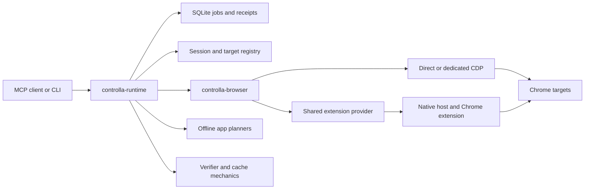

# Chrome Controlla: implementation handoff

## Follow-up implementation status — 2026-10-08

The follow-up request resumed implementation after this handoff was written. The A1–A8 diff received an independent Sol review and four additional fail-closed fixes: required discovery URLs, required DOM node tokens, guarded drag release after a failed move, and continued pairing after malformed WebSocket upgrades. The full workspace suite, warning-denied Clippy, extension harness, documentation/provenance checks, and four isolated installed-Chrome tests pass. See `docs/verification-matrix.md` for exact scope.

The local MCP entry is enabled and was served by the current Hotload child. On 2026-10-09, the active extension paired through the updated native route with one disposable local fixture; guarded form fill/type, fixture clicks, mock in-memory post, navigation invalidation/re-pair, bounded observation, release, and cleanup were verified. File-input selection remained blocked. This is fixture-only evidence and does not verify app persistence, real-site workflows, or hosted CI. The extension requires Chrome 106+ and `webNavigation`; the complete per-install setup is in `docs/clients.md`.

Prepared 2026-10-08. Companion: [research and improvement roadmap](improvements.md).

## 1. Read this first

Chrome Controlla is a Chrome-only browser-control system extracted from Comptrol. The user wants reliable foreground/background/headless operation, multiple tabs, fast extraction, good typing, resistance to user interference, reusable workflows, and professional Slides/Canva/CapCut work from several MCP clients.

**Phases 0–12 are not fully complete.** There is substantial Rust/extension infrastructure, local verification, selected live Chrome evidence, and green hosted CI for a particular commit. There is no demonstrated general app-save/export capability, qualified production verifier/cache, completed comparative benchmark, or published consumer release. Do not translate a checklist tick, planner output, transport acknowledgement, or successful localhost fixture into an end-user capability claim.

At the time this handoff was created, the preceding request asked for documentation and research only; that pass made no implementation changes. The later follow-up status above supersedes the earlier snapshot without rewriting its historical account.

### Exact checkout to continue

| Item | Snapshot verified for this handoff |
| --- | --- |
| GitHub | <https://github.com/Praket7/chrome-controlla> — public |
| Active working directory | `/Users/pcg/Documents/Codex/2026-10-06/alri/work/chrome-controlla-phase4-5` |
| Working branch | `codex/phase4-5` — integrated later-phase work despite its name |
| Local and remote branch HEAD | `2a913c6660c175d2696a5a5cfffb77d05f21c06c`, `test: pace and qualify shared typing` |
| GitHub default branch | `main`, still at `276dc2a8b7a36d795a437f03fff2c0903947a1b9`, the older Phase 3 journal baseline |
| Latest inspected CI | [run 37836483572](https://github.com/Praket7/chrome-controlla/actions/runs/37836483572), success for `2a913c6…` |
| Upstream provenance | [Praket7/Comptrol](https://github.com/Praket7/Comptrol), researched baseline `38a9d7eae0808a04b66e57d8658167c7667b4935`; Apache-2.0 |

**A fresh default clone gets the old implementation.** Select `codex/phase4-5` explicitly. The active working directory additionally contains uncommitted work; a clone does not include it. Do not reset the checkout, replace the entire project, or merge stale side branches blindly.

Preexisting dirty files, before these two handoff documents:

- `docs/blockers.md`, `docs/progress.md`, `docs/verification-matrix.md`.
- `extensions/chrome-controlla/README.md`, `background.js`, `test-background.cjs`.

These changes add sanitized command timing/phase traces, a regression fixture, and evidence corrections for the Classroom incident. They are not covered by the remote HEAD's green CI. Review and preserve their diff before committing anything. This handoff pass did not push or publish.

### Concurrent changes detected during final document review

After the initial audit, additional uncommitted changes appeared in this shared checkout. Their author/session was not established by this handoff; the two audit agents reported read-only work. Do not discard them or assume they were tested here.

Additional modified files: `.github/workflows/ci.yml`; `crates/controlla-browser/src/{input,providers}.rs`; `crates/controlla-runtime/src/{jobs,mcp,native_host,native_setup}.rs`; `crates/controlla-runtime/tests/{jobs,native_bridge_process,native_bridge_roundtrip}.rs`. The already-dirty extension files also grew. The diff appears to address A1–A8 below, including CI coverage and dispatch/input/transport guards. Review current `git diff` and obtain the originating test/review evidence before declaring any finding closed. The original six-file inventory above records the initial snapshot, not the final dirty tree.

The handoff author's changes are the two root Markdown documents. Other working sessions may continue changing this checkout; recheck status and HEAD when resuming. All code-line anchors below refer to the audit snapshot.

Other worktrees are historical: `chrome-controlla` on main; `chrome-controlla-phase6`, `-phase7`, `-phase8`, `-phase9` on corresponding branches; `/private/tmp/chrome-controlla-phase12-old` is a detached lifecycle fixture. Phase 6–8 side branches have no unique patch-equivalent commits relative to the active branch at inspection. Phase 9 has an older guide-tool commit, while current source already contains evolved guide functionality. Compare semantics before cherry-picking.

## 2. Authoritative documents and read order

All relative paths below are rooted in the active checkout above.

1. [AGENTS.md](AGENTS.md): Chrome-only scope, provenance and evidence rules.
2. [Original build plan](docs/design/build.md): original phase 0–12 requirements and gate definitions. Its checked boxes are historical claims, not an authoritative current capability inventory.
3. [Original research](docs/design/research.md) and [original improvement specification](docs/design/improvements.md): initial strategy, CC/B cases, constraints, proposed architecture.
4. [Original architecture board](https://www.tldraw.com/f/zttVZI5A_8nKRdpXihLUy): freshly fetched during this research. It connects the persistent broker, session/capability registry, exact targets, guarded workflow compiler, independent outcome verification, qualified cache/retirement, compact receipts, and user-change invalidation/yield/reconciliation.
5. [MASTER_GUIDE](docs/MASTER_GUIDE.md): current user/runtime instructions; check against actual tool schemas.
6. [Verification matrix](docs/verification-matrix.md), [blockers](docs/blockers.md), [progress](docs/progress.md): dated evidence and limitations. Read latest entries as well as summaries.
7. The original execution plan and ledger lived under `.superpowers/sdd/finish-phases-0-12.md` and `.superpowers/sdd/finish-phases-0-12/progress.md` in the authoring checkout; those local-only files are not included in this repository. Use the tracked [build plan](docs/design/build.md), [progress](docs/progress.md), and dated [verification matrix](docs/verification-matrix.md) instead.
8. This handoff and [new improvements.md](improvements.md): current reconciliation, source findings, and proposed next work.

The referenced Codex task **Research Chrome Controlla**, ID `01a110ce-5b18-7833-8177-690c31c44a22`, was read. It documents the original ambition and the Phase 3 commit; it is not the source of current live status. Prefer the checkout and dated receipts over conversation assurances.

When records conflict, use exact source revision + test artifact + observed postcondition. Keep historical failure evidence. Do not silently rewrite the original plan to make completion easier. If editing tracked design inputs, inspect `provenance/extraction.json` and its checker: some source-document hashes are tracked.

## 3. Architecture and actual code map



The diagram shows existing module relationships, not proof that all paths are integrated. App planners are not app executors; production verification/cache admission remains missing. There are **two Rust crates**, not all the crates proposed in early architecture documents.

| Location | Responsibility / important boundary |
| --- | --- |
| `crates/controlla-browser/src/lib.rs` | Extracted CDP browser engine and public browser API. |
| `manager.rs`, `session.rs`, `sessions.rs` in that directory | Connection/session machinery and session/target identity/ownership. Follow callers before consolidating similarly named layers. |
| `providers.rs` | Direct, dedicated and shared-extension transports; pairing, command/reply correlation, lifecycle. |
| `scheduler.rs` | Target/resource scheduling and admission. |
| `input.rs` | Guarded direct input primitives; currently an internal library route, not the MCP shared-input implementation. |
| `observe.rs` | Bounded structured observations/extraction and cursor behavior. |
| `native.rs`, `blocking.rs` | Native observation/helper boundaries and synchronous wrappers. |
| `crates/controlla-runtime/src/main.rs` | CLI/server/worker entry points. |
| `mcp.rs` | Large tool-routing module: sessions, shared reads/input, jobs/workflows, guide and integration. Current shared input is implemented here. |
| `capability.rs`, `doctor.rs` | Capability evaluation and diagnostics. |
| `jobs.rs` | SQLite operation journal, admission, dispatch claims, delivery/outcome distinctions, recovery. |
| `workflow.rs` | Guarded workflow compilation/execution, limits and trusted-local QuickJS child-worker path. |
| `verifier.rs`, `cache.rs` | Predicate/evidence and qualification/quarantine mechanics. Production admission/execution connection is incomplete. |
| `artifacts.rs` | Scoped artifact handles, staging and byte integrity; this alone does not prove application acceptance or saved/exported results. |
| `native_setup.rs`, `native_host.rs` | Native-host installation/manifests, discovery/pairing state and Chrome native-message relay. |
| `http_auth.rs`, `http_server.rs` | Optional authenticated loopback HTTP MCP service. |
| `apps.rs`, `slides_deck.rs`, `canva.rs`, `capcut_recipe.rs` | Offline app briefs/plans/preflight; no finished live Slides/Canva/CapCut operation routes. |
| `extensions/chrome-controlla/` | Manifest, background worker, native/manual pairing, Chrome debugger dispatch, popup and Node test harness. |
| `packages/chrome-controlla/` | Package launcher/staged distributable; generated output is not a registry publication. |
| `schemas/` and runtime crate schemas | Contract copies; package check compares them. |
| `apps/{slides,canva,capcut-web}/` | App planning/acceptance material. |
| `tests/clients/`, `tests/guide/` | Client configuration and guide checks. |
| `crates/*/tests/` | Journal, providers, input/extraction, worker, protocol, native bridge and related fixtures. |
| `bench/tasks/`, `bench/baselines/`, `bench/analysis/`, `bench/reports/` | Frozen task sets, baseline configuration, analysis/harness and status. No completed comparative experiment. |
| `scripts/`, `.github/workflows/ci.yml` | Local checks, package/lifecycle/release-candidate checks and hosted three-OS CI. |
| `provenance/extraction.json`, `LICENSE`, `NOTICE` | Extraction integrity and Apache attribution. |

## 4. Capability boundaries that the next AI must preserve

| Surface | What exists / evidence | What it does not establish |
| --- | --- | --- |
| Shared native extension | Fresh tab discovery and selected-tab pairing have worked; narrow reads, AX, fill/click and paced ASCII typing were observed. | Universal tab health, app saving, general rich-editor input, native IME, or all-platform operation. |
| Direct/dedicated Chrome | Broader library primitives, observation/extraction and isolated installed-Chrome fixtures. | Parity with shared MCP tools or noninterference with a user's foreground desktop. |
| Typing | Actual local shared typing of `Hello, world!`; 65 recorded events; 12 keydown gaps roughly 66.7–81 ms, median 71 ms; final value/focus/caret checked. | Human-equivalent IME, accessibility typing, React/rich-editor correctness or anti-detection. Unicode fill is not key-by-key Unicode composition. |
| Input guard | Target/value/focus checks and interference fixtures exist. | Correctness for every DOM replacement, readonly control, OOPIF or user action; see source findings below. |
| File/artifacts | Local scoped file/artifact transport/selection and integrity fixtures. | App upload completion, server persistence, exported bytes, professional output quality. |
| Extraction | Bounded reads/cursors and synthetic direct-Chrome fixtures. | Complete extraction from virtualized/hidden app sections; shared route still lacks equivalent extraction/crop coverage. |
| Scripts/workflows | Bounded trusted-local child process, journal/checkpoint mechanics; direct CDP path. | Untrusted-code sandbox, shared-provider parity, reliable live browser-session resume, cancel tool or measured speedup. |
| Verifier/cache | Local policy and state mechanics. | A trusted production observer that can qualify an app outcome and admit/run cached workflows. |
| App tools | Structured planners/preflight for Slides/Canva/CapCut. | Creating or editing an app artifact. Never call a returned plan a completed design. |
| Clients | Local protocol checks; narrow OpenCode guide call. | General acceptance in Freebuff, Claude Code or ChatGPT; extension connected is not tool availability. |

## 5. Phase-by-phase reconciliation

“Implemented” means code exists; “fixture-tested” means the stated synthetic/local case passed; “live-observed” is limited to the actual target and postcondition. None means universally qualified.

| Phase | Current evidence-backed position | Required exit work |
| --- | --- | --- |
| 0 — extraction/baseline | Source/provenance/toolchain/CI baseline exists. | Reconcile old complete checkboxes to actual dated artifacts; preserve attribution and scope. |
| 1 — capabilities/setup | Registry/CLI/doctor/package foundation exists and has local checks. | Qualify normal consumer setup and browser/client dispatch for each advertised support combination. |
| 2 — sessions/providers | Persistent targets, ownership and scheduling fixtures; selected live macOS extension path. | Navigation/replacement binding, lifecycle/recovery, repeated user interference and supported platform/headed behavior. |
| 3 — durable jobs | Local journal/recovery including seven crash cut points; some async CDP/extension checks recorded. | Fix correlation reclaims; test browser/service kill boundaries and independent reconciliation. No exactly-once browser-effect claim. |
| 4 — input | Direct primitives plus narrow shared live fill/click/ASCII typing. | Internal source defects; shared parity; rich editors/native IME/canvas; app acceptance/persistence; repeated focus/cursor/clipboard and OS qualification. |
| 5 — observation | Bounded extraction/cursors/AX/crops in direct fixtures; shared reads observed. | Representative real apps, shared extraction parity, hidden/virtualized sections, completeness/performance evidence. |
| 6 — workflows | Compiler/bounds/QuickJS worker and local recovery mechanics. | Shared provider integration, cancellation, live invalidation/resume, OS resources/isolation before untrusted use, fair workflow comparisons. |
| 7 — verification/cache | Local evidence/trust and qualification mechanics only. | Independent production observer, app persistence/export proof, cache admission and execution integration, drift retirement tests and performance. |
| 8 — app workflows | Plans/briefs/recipe validation only. | Real Slides/Canva/CapCut edit → save → reopen → export → quality checks. |
| 9 — clients | Stdio and loopback HTTP tests; guide usability fixtures; OpenCode 1.18.5 made one guide call with local Qwen2.5 7B. | End-to-end client actions/jobs/artifacts/reconnect/cancel. Later Freebuff attempts failed; broader Claude/ChatGPT acceptance open. |
| 10 — evaluation | 30-task pilot; 100 held-out tasks ×5 runs; 20 critical tasks ×10 runs preregistered; offline analysis checks. | Qualify frozen baseline/model configurations, run pilot, lock changes, run held-out/ablations, publish denominators/costs/failures. |
| 11 — learning | Optional and deferred. | Only consider after consented/redacted traces, reliable verifier and controlled held-out improvement. Not needed to ship an honest initial release. |
| 12 — release | Local unpublished candidate/package lifecycle checks; hosted macOS/Linux/Windows build/package CI. | Exact candidate binding, signed/distributed artifacts as required by support policy, clean published consumer installs, compatibility matrix and rollback. |

### Stale records to reconcile, not erase

- `docs/design/build.md:113–120`: all Phase 0 items are ticked; bind each conditional/repository/baseline assertion to evidence.
- `build.md:183–188`: broad native/input statements exceed one isolated native snapshot and the narrower shared input route. Distinguish direct-library implementation from user-facing MCP capability.
- `build.md:271–284`: append later Freebuff failure and restrict OpenCode acceptance to one guide call. A guide/config fixture is not an external workflow.
- `build.md:324–335`, `docs/progress.md:228–230`: multiple older release candidates and CI runs are mixed. Preserve them with their original commit; current HEAD CI is separately identified above.
- `.superpowers/sdd/finish-phases-0-12/progress.md`: an older candidate `cdaeaf9` is an ancestor, not current completion status.

Line numbers are audit anchors for this snapshot and may move after edits.

## 6. Source audit: baseline findings and repair verification queue

Independent read-only Sol/high source audit produced seven findings against the inspected baseline at HEAD `2a913c6` (plus the then-present diagnostic patch). These are source-supported triggers, **not newly reproduced failures**. Concurrent uncommitted edits subsequently appeared that seem to address A1–A8; this handoff has not qualified those repairs. Treat the table as regression requirements and review the current diff before implementing duplicate fixes. Reproduce with a focused test before changing behavior. Priority here is an implementation order, not a claim of observed exploitation.

| ID / priority | Source and trigger | Impact | Minimal repair and acceptance test |
| --- | --- | --- | --- |
| A1 / high | `mcp.rs:1595–1608`; extension `background.js:126–149`. Fresh inventory validates tab ID, then extension attaches by ID without binding selected page URL/document. | Navigation between selection and attach can grant a different page. Broad user authorization in this task does not fix product semantics. | Include selected origin/URL and document/generation policy; check immediately before/after attach and invalidate on navigation. Test navigation/replacement during pairing and verify no action reaches the new document without revalidation. Define allowed same-origin navigation explicitly. |
| A2 / medium | `providers.rs:553–579`. First unauthenticated socket can consume the entire pairing deadline, up to 300s, during handshake/hello. | One silent local connection delays or blocks real pairing. | Short per-peer handshake/hello deadline within total budget; close bad peer and continue. Test silent TCP/WS peer followed by a legitimate extension. Bound concurrent peers. |
| A3 / medium | `providers.rs:830–855`; outer timeout in `mcp.rs:2301–2311` and similar callers. Pending reply inserted before send; early cancellation skips own timeout cleanup. | Connected extension that never replies can cause pending-map growth after repeated canceled calls. | Cancellation-safe pending-entry ownership/cleanup; cap outstanding commands. Test drop after send, no reply, late reply, connection close and repeated cancel; pending count must return to baseline without replay. |
| A4 / high | `jobs.rs:208–210`. `record_dispatch` allows a new claim after `delivery='sent'`, including an already acknowledged correlation. | Journal contract permits duplicate dispatch claims; actual duplicate browser effect depends on caller reuse. | Persist unique per-operation step correlations while allowing distinct steps; reject/replay same claim after acknowledgement. Test same correlation before/after ack, new correlation, restart, and uncertain delivery. Preserve delivery/outcome separation. |
| A5 / medium | `input.rs:365–368`, `562–579`. Direct fill checks visibility/disabled but not `readOnly`, then sets value programmatically. | Internal direct route can write a readonly field and report Applied. | Check readonly/editability in both admission and bound-node mutation; readonly input/textarea regression. This is not the live MCP shared-input route. |
| A6 / high | `input.rs:350–353`, `491–499`, `562–579`. Probe and focus/mutation resolve selector separately. | Same-selector/same-value replacement can receive the write with a success report. | Retain node/context identity across probe and dispatch; reject disconnected/replaced node. Inject replacement at boundary; assert replacement value unchanged. Internal direct route. |
| A7 / medium | `input.rs:817–818`, `846–848`. Press followed by release using `?`; no recovery when release fails. | Pointer state becomes uncertain after accepted press. | Bounded scoped release attempt if target/session still valid, report unknown if not confirmable; never release on a newly substituted target. Inject release failure for click/drag. Internal direct route. |

### At-handoff review queue (historical snapshot; see current status above)

The following concerns were raised against the unqualified dirty diff as it appeared during the original handoff. The follow-up has since fixed several and re-ran focused checks; the remaining A1 document-identity limit and the lack of shared-extension live qualification are recorded in the current matrix. Do not read these old source observations as a description of the current code without checking the current branch.

A final read-only review identified these additional concerns in the newly appearing dirty diff. They have not been behaviorally reproduced in this handoff and may change as the other session continues:

- **A6 proposed node guard:** `resolve_element_script` appears to generate and assign a fresh `__controllaNodeToken` on every resolution, while later guards compare it to the earlier token. That can reject an unchanged node. Require an actual browser test proving ordinary same-node input succeeds AND replacement is refused; source-string assertions are insufficient.
- **A4 proposed duplicate guard:** checking only the current `dispatch_correlation` does not retain prior step claims after another step overwrites the field. Test step-0 acknowledged → step-1 acknowledged → step-0 claimed again. Persist per-operation step history or an equivalent invariant.
- **A3 proposed drop cleanup:** a `try_lock` cleanup that silently skips when the mutex is held can still leak. Test cancellation while the pending-map lock is contended; require eventual cleanup.
- **A1 proposed URL check:** a check before `chrome.debugger.attach` alone leaves navigation during attachment unresolved. Compare identity after attachment and bind navigation listeners without a gap. The inspected listener handles native attachments, not manual popup attachments; qualify both or explicitly restrict support.

These observations reinforce the need to review the actual latest diff rather than treating an apparent fix or a newly added test as proof. No source edits were made by the handoff reviewers.

### Additional verified engineering gap

**A8 — committed CI coverage is narrower than the local check catalog.** `.github/workflows/ci.yml` runs Rust fmt/clippy/tests, build/package, docs, provenance and dependency checks. It does not run `check:clients`, `check:apps`, `check:bench`, or `extensions/chrome-controlla/test-background.cjs`. Inspected package/docs scripts do not transitively run these. The release-candidate script does run several of them, but CI does not invoke that script. Add the lightweight checks to an appropriate CI job; retain platform-dependent browser acceptance separately. The inspected green build used the old configuration. The concurrent dirty CI diff adds these checks, but that diff has not been qualified by hosted CI in this handoff.

Other gaps such as missing app executors, production cache admission, native IME or benchmarks are missing functionality/qualification, not newly discovered regressions. Avoid inflating the bug count with every unimplemented phase.

## 7. Native bridge, MCP and the recent timeout

### Normal setup path

1. Inspect the actual client tool inventory. In this task Controlla is exposed through the **Hotload child server** `chrome-controlla`, not direct named top-level tools. Use Hotload search/status/call for that server and retrieve schemas; do not infer absence from top-level names alone.
2. Before this handoff request, status reported ready, revision 3, 21 tools; a `guide` call succeeded. This is a dated connection observation, not a permanent guarantee or proof of browser effects.
3. Use the installed `controlla` executable's help and `install-bridge <actual-extension-id>`. Load `extensions/chrome-controlla` unpacked if required. Match the native manifest's exact allowed extension origin. Verify executable path and version/build identity.
4. Normal flow: `discover_shared_tabs` → `pair_shared` with freshly returned `host_id` and selected `target_ids` → `accept_shared` → `list_shared_targets` → bounded action/read → `release_shared`. Inspect current schemas for exact argument types. Native inventory freshness is limited; rediscover rather than reuse old IDs.
5. Normal native messaging should not require the user to copy a WebSocket endpoint and token. The popup manual path is a fallback. Do not paste tokens, profile contents or credential files into chat/docs.
6. Chrome debugger permission/indicator behavior is controlled by Chrome. Do not promise that a bridge eliminates all consent UI or use bypass flags. Reload the extension only after an extension change; restart/reload MCP only when its process/build actually changed.

The local extension ID observed earlier was `bhgfjpbajecihfbgaikampminappgodh`; verify the user's current installation instead of baking that ID into a release. The runtime/extension reported 0.1.0, which is insufficient to distinguish many builds. Add build/compatibility identity as proposed in the companion roadmap.

### Incident reconstruction

- User's original testing Classroom tab stalled on `Page.getFrameTree`.
- Extension trace showed dispatch at 0 ms, error settlement around 22,004 ms, then suppressed reply around 22,005 ms. The native request deadline was 20 seconds. Reply suppression after expiry/release is expected; it does not explain why the browser command stalled.
- An independent browser-control handle/title read also timed out on that original tab. A disposable localhost target returned a frame tree immediately.
- A fresh tab at the same authorized URL, `https://classroom.google.com/c/ODI2NTQ5Mjc1ODU3`, passed actual Controlla target listing and bounded heading observation (“Classroom / testing”). The temporary target was released and closed.
- This supports a target-specific stale/unresponsive renderer or attachment hypothesis. The exact Chrome cause was not proven, and a reload of the original tab was not demonstrated to fix it. Do not state that all native connection problems were resolved.
- No classwork was changed by these checks. No live Slides/Canva/CapCut editing/save qualification followed from them.

The dirty diagnostic patch records bounded command metadata/timing/outcome. Keep it free of typed text, raw evaluation arguments, tokens and page content. Before replaying an uncertain write, reconcile the target state; retrying a read and replaying a side effect are different recovery decisions.

## 8. Tests, commands and evidence scope

Pinned snapshot: Rust 1.99.0; Node 24.19.0; npm 11.17.0; Playwright 1.63.0. Consult lockfiles/toolchain files before installation. Do not upgrade dependencies as a side effect of continuing the handoff.

Useful commands from the active root (run when relevant to the successor's changes):

```sh
git status --short
git diff --check
cargo fmt --all -- --check
cargo clippy --workspace --all-targets --locked --offline -- -D warnings
cargo test --workspace --locked --offline
node extensions/chrome-controlla/test-background.cjs
node --check extensions/chrome-controlla/background.js
npm run check:docs
npm run check:provenance
npm run check:clients
npm run check:apps
npm run check:bench
./scripts/check-dependencies.sh
```

Offline Cargo checks require dependencies already present. Package verification additionally requires the staged package; inspect `scripts/package-build.sh` and `scripts/package-check.sh`. The latter installs a packed archive into a temporary clean prefix and checks lifecycle behavior. It does not publish or prove registry consumer installation. Review `scripts/prepare-release-candidate.mjs` before invoking its larger candidate flow.

Historical evidence recorded before this documentation pass includes full Rust tests/fmt/clippy, dependency/docs/provenance/client/app/benchmark checks, package lifecycle checks, and three explicitly enabled isolated installed-Chrome provider tests. Ordinary `cargo test` does not imply ignored Chrome tests ran. The focused extension trace fixture, JavaScript syntax, docs links and diff checks passed immediately before the handoff request. Consult the progress/matrix for exact invocations and artifacts; this document does not invent one uniform test run covering every current file.

Hosted CI success is bound to `2a913c6…`. Local tests are not hosted evidence for the dirty tree. Build/package tests on three OSes are not three-OS headed-browser, native IME or real app qualification.

## 9. Recommended next implementation sequence

1. **Preserve and identify:** inspect dirty files; record branch/HEAD/runtime hash/extension hash. Establish one dated evidence manifest without discarding history.
2. **Reliability defects first:** reproduce/fix A1–A4 and A8, then A5–A7 before exposing direct input more broadly. Use tiny focused fixtures, independent review, then relevant suite.
3. **One complete user workflow:** choose a disposable Slides test deck. Pair → identify document → edit a small object/text → independently read saved state → reopen → verify → export and inspect actual bytes. Implement missing executor/verifier pieces rather than expanding planner vocabulary.
4. **Provider contracts/parity:** use one typed action/observation contract with explicit capabilities. Shared provider must return unsupported for absent routes, not silently route through an unrelated browser tool.
5. **Input and interference:** qualify textarea, contenteditable, rich-editor, iframe and composition cases; inject user changes and navigation between every meaningful boundary. Separate DOM composition fixtures from real OS IME evidence.
6. **Jobs/workflows/cache:** connect cancellation/reconciliation and independent verification; only then permit cache admission and workflow reuse. Avoid silent retries of unknown effects.
7. **App/client expansion:** repeat vertical acceptance for Canva, then CapCut; test real external-client execution and reconnect/artifacts. Keep app/API-assisted tracks distinct.
8. **Evaluation and release:** run frozen pilot, fix, then held-out trials. Publish supported capabilities and failures; qualify a clean install of an exact release candidate. Phase 11 can remain explicitly deferred under the original optional gate.

See the companion roadmap for dependencies, failure injections, UX, source links and measurable goals. Do not start six agents against the same runtime/extension files. The user's cost preference was Luna/low implementers with independent Sol/high review. Use bounded independent ownership and a single browser test driver; service tier is not necessarily controllable through the agent tool. Never claim a requested non-fast mode was applied without a setting that supports it.

## 10. Access, stopping conditions and successor brief

The user previously authorized tests in their test Classroom and open Slides/Canva/CapCut environment, including disposable uploads and opening tabs. Prefer named disposable test artifacts and preserve personal content. Scope this inherited permission to the tests requested; do not infer permission to publish/share/send messages, delete unrelated work, purchase subscriptions or release credentials. Sign-in/account availability must be observed when testing, not assumed from old screenshots.

Ask for human action only for a real external boundary: sign-in/2FA, required Chrome consent/reload that cannot be safely completed, unavailable native IME/OS hardware, or product decisions with irreversible effects. Explain the exact blocked step and keep independent work moving. Do not ask the user to reload repeatedly without evidence of which process/version is stale.

### Pasteable brief for the successor

> Continue Chrome Controlla from `codex/phase4-5` in `/Users/pcg/Documents/Codex/2026-10-06/alri/work/chrome-controlla-phase4-5`. Read AGENTS.md, the three original docs/design files, MASTER_GUIDE, the current evidence matrix/blockers, handoff.md and root improvements.md. Preserve all dirty work. Verify actual MCP/runtime/extension identities and do not use stale host/tab IDs. Reproduce and repair the source-audit queue with focused regression tests and independent review, then build one complete real-app save/reopen/export workflow before expanding. Separate implemented, fixture-tested, live-observed and qualified states. Retain unknown outcomes after ambiguous dispatch. Do not claim phases 0–12 complete, all-platform support or competitive superiority without their specified evidence. Update dated evidence and report exact remaining gates. Use small Luna implementation tasks and a stronger independent reviewer when useful; keep one owner for live browser tests.

## 11. Handoff limits

This is a targeted architecture/source audit and research synthesis, not an exhaustive security audit. Seven baseline code findings are unexecuted source hypotheses with concrete test plans; A8 is a verified omission in the committed CI configuration. Concurrent dirty repairs require independent review and tests before closure. The repository/default-branch/CI snapshot and original board were checked during this pass. No application state was modified and no implementation repairs were made for this handoff. Reverify moving facts when resuming.
